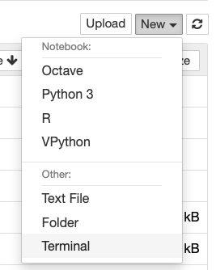

There are multiple ways of running Python code and programs. Besides running Python in Jupyter Notebooks many people will create scripts, i.e., stand-alone text files with Python code. We will do this on JupyterHub first. Those interested can install Python on their own computer and run either Jupyter Notebooks or stand-alone scripts.

## Create a script file in JupyterHub and run it

Create an empty notebook with one codecell with the following program:

~~~
from datetime import datetime
print(datetime.now())
~~~
{: .python}

Try it out, you should see the current date and time.

Save the notebook with `Now` as the name

Next, in the Notebook browser window, click on the 'New' and select 'Terminal'. NOTE make sure you do this in the same folder as where your `Now.ipynb` notebook is stored.

  

The terminal accepts commands and executes them immediately after you press the 'return' key. It is a so-called Unix Shell, to be precise, the bash shell. We won't cover many command, only those we need to convert our `Now.ipynb` notebook to a stand-alone Python script and to execute it using Python.

First, we need to navigate to the folder containing the `Now.ipynb` notebook. The command `ls` will show all files and folder, as you would see them in the Notebook browser. You may need to navigate to the `MBV3070 folder`. Do this with

~~~
cd MBV3070
~~~
{: .bash}

The command `ls` should now show you all files and folder, including the `Now.ipynb` file, which is your `Now` notebook.

~~~
jupyter-nbconvert --to python Now.ipynb
python my_book.py
~~~
{: .bash}

This should result in the output in the terminal window with the current date and time.

## Getting input from the command line

Create an empty notebook that is called "sys-test.py". Put the following content into it:

~~~
import sys
print(sys.argv)
for element in sys.argv:
    print(element)
print(sys.argv[1])
~~~
{: .python}

Run the commands shown below on the command line:

  * python sys-test.py 1
  * python sys-test first second
  * python sys-test.py 1 2 3 4
  * python sys-test.py

Question: can you figure out why the last one fails?

FIXME can use Python text editor from Jupyter

## Import functions from script files

## Dual usage of script files

`if __name__ == "__main__":`
